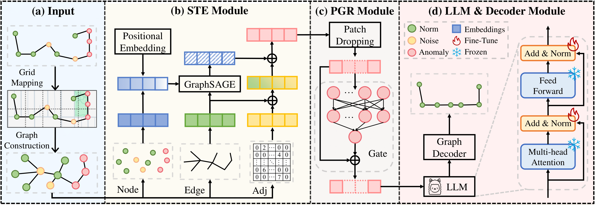

# Towards Trajectory Anomaly Detection: A Fine-Grained and Noise-Resilient Framework

In this paper, we propose an LLM-driven approach, FOTraj, for fine-grained and noise-resilient trajectory anomaly detection.

The framework of FOTraj consists of four key stages: (a) Input Stage (i.e., Preprocessing), (b) Spatio-Temporal Dependency Encoder (STE), (c) Patch-Gated Robustification (PGR), and (d) LLM \& Decoder Stage. Given a raw trajectory, the Input Stage preprocesses the data and transforms it into a spatio-temporal graph structure. In the STE module, the trajectory's spatial and temporal dependencies are encoded into a vector representation suitable for LLM processing. To enhance robustness against noise, the PGR module selectively applies perturbations to simulate real-world uncertainties in trajectory data. Finally, in the LLM \& Decoder Stage, the LLM processes the encoded representation, and the decoder reconstructs the spatio-temporal graph structure. Anomalies are then detected by comparing the reconstructed trajectory with the original input using DTW distance metric. The following sections elaborate on each component in detail.

Experiments conducted on three datasets with four different anomaly types demonstrate the framework's superiority. In future work, we aim to extend FOTraj’s versatility by integrating few-shot and zero-shot learning capabilities and incorporating multi-modal data, including textual descriptions and road networks.




## Environment
- Python.version = 3.9.2
- PyTorch.version = 2.5.1
- Other dependencies are listed in `requirements.txt`.

## Base LLM
In this experiment, we use the [LLAMA-3.1-8B](https://huggingface.co/meta-llama/Llama-3.1-8B-Instruct) model. If computational resources are limited, you can also use the [LLAMA-3.2-1B](https://huggingface.co/meta-llama/Llama-3.2-1B-Instruct) model or other models. Please place the downloaded model in the main directory and modify the LLM_path parameter during training or testing.

## Datasets

We use three public datasets, [Chengdu](https://drive.google.com/file/d/1JDVDeEq7chFuGwVL7Eu3tE_SWbA061cd/view?usp=drive_link), [Porto](https://www.kaggle.com/c/pkdd-15-predict-taxi-service-trajectory-i/data), and [NUMOSIM](https://osf.io/sjyfr/). Please download the original dataset and place it in the `../datasets` folder.

For convenient testing, we also provide a [test file](https://drive.google.com/file/d/1DEbzCWO66sSwhIMN3Vf0gUQ7YSlmRTvd/view?usp=drive_link) from the Chengdu dataset. Please download it, and place it in the `../datasets/chengdu` folder, and then generate ground truth for testing.

## Generating ground truth

To generate the ground truth for the Porto and Chengdu dataset, run the following command:

```bash
python data_provider/generate_outliers.py
```

## Checkpoints
To make it easier for readers with limited computational resources to test, we provide the 1B version of the Chengdu dataset checkpoint. Click [here](https://pan.quark.cn/s/54c448218752) to download.

After downloading the checkpoint, place it in the `../checkpoints` folder and run the testing code. Please note that the performance of the 1B model is significantly different from the 8B model, but it still performs quite well.

## Compilation
The training example of FOTraj is as follows:

```bash
python train.py --LLM_path 'llama_path' --dataset chengdu --noise False --is_training True --task detour 
```

The testing example of FOTraj is as follows:
```bash
python train.py --LLM_path 'llama_path' --dataset chengdu --noise False --is_training False --ckpt_path './checkpoints/chengdu/checkpoint.pth' --task detour
```

